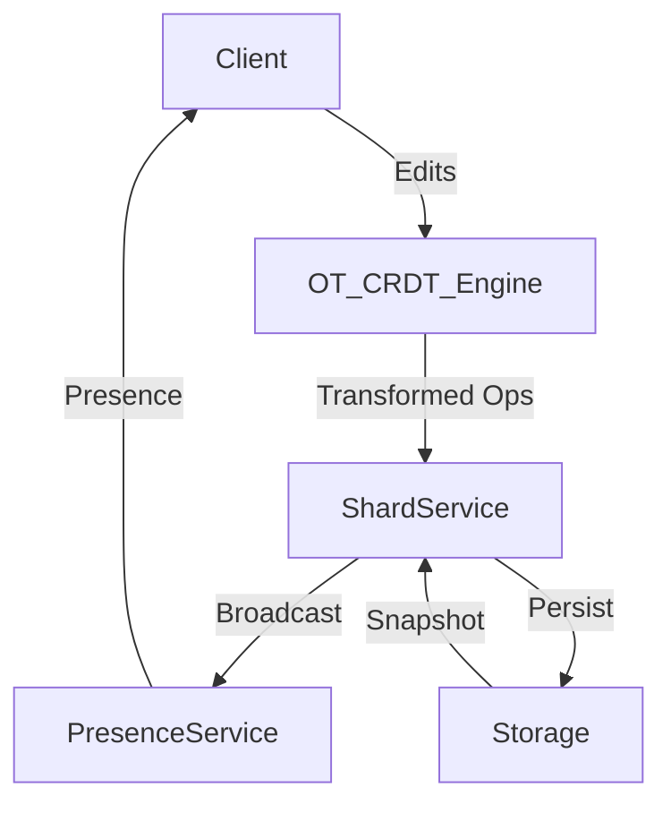

# Collaborative Document Editing (Google-Docs-lite) — Deep Dive

## 1. Problem Statement & Scope
Design a Google Docs–like system for real-time collaborative editing, supporting dozens of concurrent users, presence, versioning, and robust conflict resolution. The system must ensure low-latency convergence, offline support, and operational resilience.

## 2. Functional & Non-Functional Requirements

### Functional Requirements
- Real-time multi-user editing with sub-second latency
- User presence and cursor/selection sharing
- Version history and undo/redo
- Conflict-free merging of concurrent edits
- Late joiners see latest state instantly
- Support for comments, suggestions, and permissions

### Non-Functional Requirements
- **Scalability:** 100+ concurrent editors per doc, 1M+ docs
- **Reliability:** No data loss, robust against network partitions
- **Low Latency:** p99 < 200ms for edit propagation
- **Offline Support:** Edits sync when reconnected
- **Security:** Access control, audit logs

## 3. Core Architecture & Data Model

- **Editing Engine:**
    - **OT (Operational Transform):** Server-centric, easier for centralized control
    - **CRDT (Conflict-free Replicated Data Type):** Peer-to-peer/offline, eventual consistency
- **Doc Shard Service:** Horizontally sharded doc servers for scalability
- **Presence/Notification:** PubSub for user presence, typing, and cursor updates
- **Snapshot & Compaction:** Periodic snapshots for fast late join and recovery
- **Storage:**
    - **Op Log:** Append-only log of all edits
    - **Snapshots:** Periodic full doc state
    - **Metadata:** User, permissions, comments

## 4. High-Level Architecture Diagram

## 5. Detailed Workflows

### a) Real-time Editing
1. User types in client; edit sent to OT/CRDT engine
2. Engine transforms/merges edit, assigns version
3. Edit broadcast to all clients via ShardService
4. Clients update local state, show remote cursors

### b) Late Joiner
1. New user connects to doc
2. Receives latest snapshot + op log since snapshot
3. Applies ops to reach current state

### c) Offline Editing
1. User edits offline; ops queued locally
2. On reconnect, ops sent to server, merged via CRDT/OT
3. Conflicts resolved automatically

### d) Versioning & Undo/Redo
1. All ops stored in log with user/timestamp
2. Undo/redo traverses op log
3. Version history allows rollback and diff

## 6. Scaling, Fault Tolerance, and Trade-offs

- **Scaling:**
    - Shard docs by docId for horizontal scaling
    - Use distributed pubsub (e.g., Redis, Kafka) for presence and edit broadcast
- **Fault Tolerance:**
    - Persist all ops and snapshots to durable storage
    - Use leader election for shard failover
- **Trade-offs:**
    - OT is simpler for server-centric, but CRDT is better for offline/P2P
    - Snapshots speed up late join but increase storage

## 7. API & Interface Design

### Client APIs
- `POST /edit`: Submit edit op
- `GET /snapshot`: Get latest doc state
- `GET /presence`: Get current users/cursors
- `POST /comment`: Add comment

### Admin APIs
- `GET /audit`: Get edit history
- `POST /restore`: Restore to previous version

## 8. Security & Operational Considerations

- **Security:**
    - Per-doc/user access control
    - All edits and comments logged for audit
- **Monitoring:**
    - Real-time dashboards for doc activity, errors, and latency
- **Disaster Recovery:**
    - Regular backups of op logs and snapshots

## 9. Best Practices & Industry Insights

- Use CRDT for offline-first, OT for centralized
- Always persist ops before broadcasting
- Use vector clocks or Lamport timestamps for ordering
- Snapshots every N ops for fast recovery
- Integrate with cloud storage for durability
- Design for graceful degradation (read-only mode on failure)

---

This design is inspired by Google Docs, Etherpad, and Figma, and can be extended for rich media, plugins, and enterprise features.
