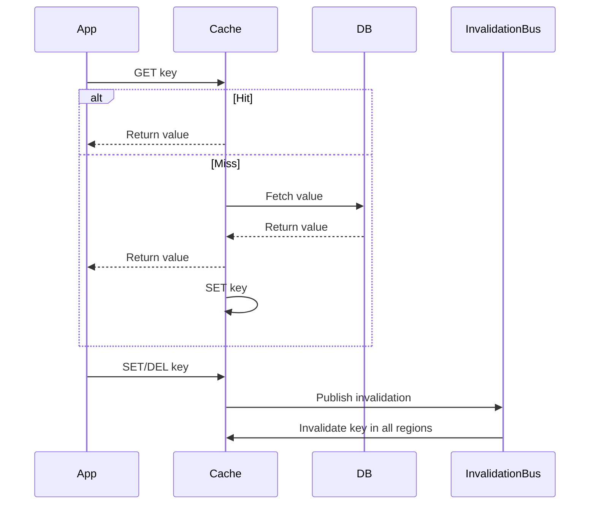

# Distributed Cache (Multi-Region) — Deep Dive

## 1. Problem Statement & Scope
Design a highly available, low-latency, multi-region distributed cache to accelerate database reads and writes for global applications. The system must support strong or eventual consistency, explicit invalidation, seamless failover, and data locality for optimal performance.

## 2. Functional & Non-Functional Requirements

### Functional Requirements
- Store key-value data with TTL and versioning
- Support read-through, write-through, and write-behind patterns
- Explicit cache invalidation (by key, pattern, or region)
- Multi-region deployments with data locality and failover
- Metrics and monitoring for cache hits/misses, latency, and invalidations

### Non-Functional Requirements
- **Low Latency:** <10ms for local reads, <50ms for cross-region
- **High Availability:** Survive region and node failures
- **Consistency:** Configurable (eventual/strong, per key or namespace)
- **Scalability:** 1M+ QPS, 10TB+ data, 5+ regions
- **Security:** Encrypted in transit and at rest, access control

## 3. Capacity & Scale Estimation

- **Cache Size:** 10TB total, 5 regions, 2TB/region
- **QPS:** 1M/sec global, 200k/sec/region
- **Key Size:** 64B avg, Value Size: 1KB avg
- **Replication Lag:** <1s for eventual, <100ms for strong

## 4. High-Level Architecture

```mermaid
graph TD
    App1[App Server (Region 1)] --> Cache1[Cache Cluster (Region 1)]
    App2[App Server (Region 2)] --> Cache2[Cache Cluster (Region 2)]
    Cache1 <--> InvalidationBus[Global Invalidation Bus (Kafka)]
    Cache2 <--> InvalidationBus
    Cache1 --> DB1[Primary DB (Region 1)]
    Cache2 --> DB2[DB Replica (Region 2)]
    InvalidationBus --> Cache1
    InvalidationBus --> Cache2
```

**Components:**
- **Regional Cache Cluster:** Redis/Memcached/Custom, per region, sharded for scale
- **Global Invalidation Bus:** Kafka/PubSub for propagating invalidations and updates
- **Primary DB + Replicas:** Source of truth, cache misses/read-throughs go here
- **Consistency Controller:** Ensures strong/eventual consistency as configured
- **Monitoring & Metrics:** Tracks hit/miss, latency, replication lag

## 5. Data Model & API Design

### Data Models
- **Cache Entry:** {key, value, version, timestamp, ttl, region}
- **Invalidation Event:** {key/pattern, version, region, timestamp, type}

### API Endpoints
- `GET /cache/{key}`: Get value
- `SET /cache/{key}`: Set value
- `DEL /cache/{key}`: Delete key
- `INVALIDATE /cache/{pattern}`: Invalidate keys by pattern
- `GET /metrics`: Get cache stats

## 6. Detailed Component Breakdown

- **Regional Cache Cluster:**
    - Handles all local traffic for low latency
    - Sharded for scale, replicated for HA
    - Supports local and global invalidation
- **Global Invalidation Bus:**
    - Propagates invalidation and update events to all regions
    - Ensures cache coherence across the globe
- **Primary DB + Replicas:**
    - Source of truth for all data
    - Cache misses/read-throughs go here
- **Consistency Controller:**
    - Configurable per key/namespace (eventual/strong)
    - Uses distributed locks or consensus for strong consistency
- **Monitoring & Metrics:**
    - Real-time dashboards for hit/miss, latency, replication lag

## 7. End-to-End Flow (Cache Read/Write/Invalidate)



## 8. Scaling, Fault Tolerance, and Trade-offs

- **Scaling:**
    - Shard cache clusters for scale
    - Use async pub/sub for invalidation propagation
- **Fault Tolerance:**
    - Multi-AZ deployment, failover nodes
    - Each region operates independently; global bus ensures coherence
- **Trade-offs:**
    - Eventual consistency is fast, but may serve stale data
    - Strong consistency is slower, requires cross-region coordination
    - Choose per use case: session tokens (strong), product catalog (eventual)

## 9. Security & Operational Considerations

- **Security:**
    - Encrypt data in transit (TLS) and at rest
    - Access control for cache APIs
- **Monitoring:**
    - Real-time dashboards for cache health, usage, and errors
- **Disaster Recovery:**
    - Regular backups of cache metadata and config

## 10. Best Practices & Industry Insights

- Use versioning for all cache entries to avoid stale writes
- Prefer local reads, but always support global invalidation
- Use async propagation for scale, but allow strong consistency for critical data
- Integrate with application monitoring for end-to-end visibility
- Design for graceful degradation (read-through to DB on cache miss)

---

This design is inspired by Netflix EVCache, AWS ElastiCache Global Datastore, and other global-scale caching systems, and can be extended for write-behind, near-cache, and edge caching.
