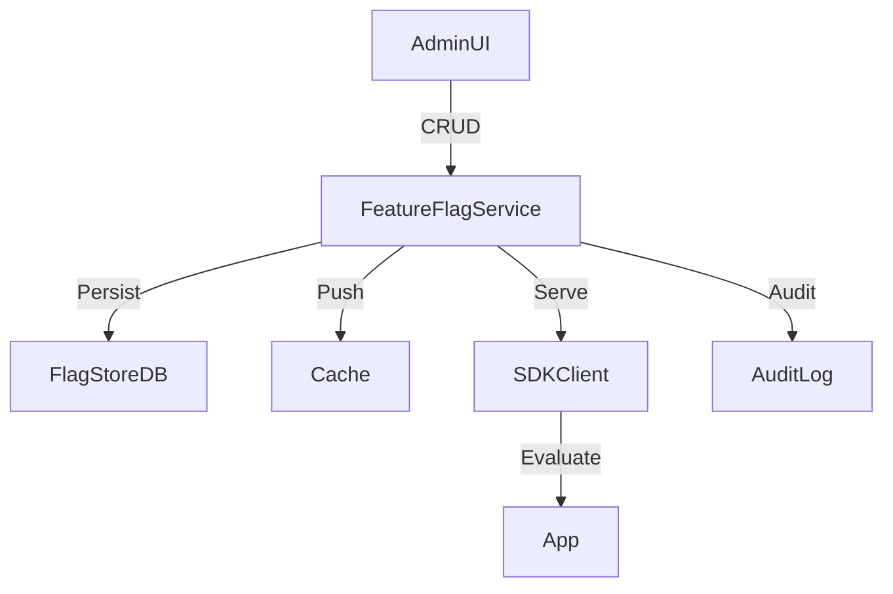
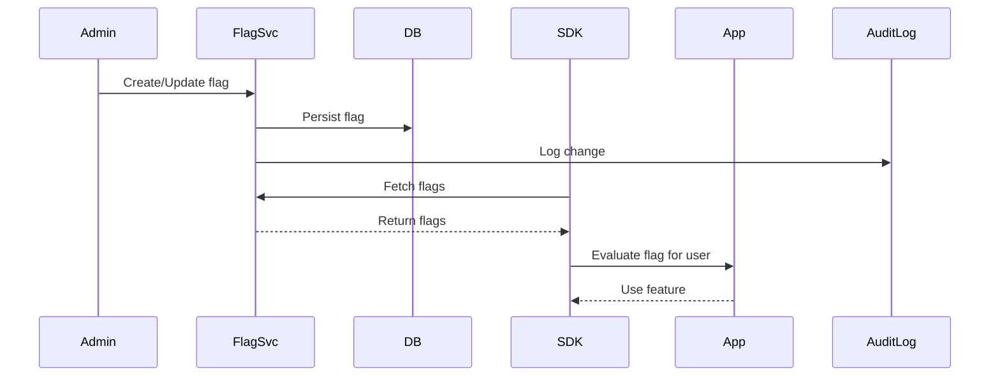

# Feature Flag Service (Local) — Deep Dive

## 1. Problem Statement & Scope
Design a robust, local-first feature flag service to enable/disable features for users, groups, or segments without redeploying code. The system must support fine-grained targeting, percentage rollouts, instant rollbacks, and low-latency evaluation in the app or SDK.

## 2. Functional & Non-Functional Requirements

### Functional Requirements
- Create, update, delete feature flags
- Target flags by user, group, segment, or percentage rollout
- Evaluate flags in the app (SDK or API)
- Audit log for all flag changes
- Support for flag dependencies and prerequisites
- Admin UI for flag management and monitoring

### Non-Functional Requirements
- **Low Latency:** <5ms flag evaluation (critical path)
- **Reliability:** No flag loss, safe rollbacks, high availability
- **Consistency:** Eventual consistency for local cache, strong consistency for writes
- **Security:** Role-based access control for flag changes

## 3. Capacity & Scale Estimation

- **Flags:** 10,000+
- **Users:** 1M+
- **QPS:** 10k/sec flag evaluations, 100/sec writes
- **SDKs:** 1000+ connected clients

## 4. High-Level Architecture

**Components:**
- **FeatureFlag Service:** Central API for flag CRUD, targeting, and evaluation
- **Flag Store (DB):** Durable storage (RDBMS, NoSQL)
- **Cache:** In-memory cache (Redis, local SDK cache) for fast reads
- **SDK Client:** Fetches, caches, and evaluates flags locally
- **Admin UI:** For flag management, monitoring, and audit
- **Audit Log:** Stores all flag changes for compliance

## 5. Data Model & API Design

### Data Models
- **Flag:** {flag_id, name, enabled, targeting_rules, rollout_percentage, prerequisites, updated_at}
- **TargetingRule:** {rule_id, flag_id, user_id/group_id/segment, condition, value}
- **AuditLog:** {log_id, flag_id, action, user, timestamp, before, after}

### API Endpoints
- `POST /v1/flags`: Create flag
- `GET /v1/flags/{flag_id}`: Get flag
- `PUT /v1/flags/{flag_id}`: Update flag
- `DELETE /v1/flags/{flag_id}`: Delete flag
- `GET /v1/flags`: List all flags
- `GET /v1/audit`: Get audit log

## 6. Detailed Component Breakdown

- **FeatureFlag Service:**
    - CRUD for flags, manages targeting rules, exposes API for SDKs
    - Pushes updates to SDKs via WebSocket or polling
    - Handles flag dependencies and prerequisites
- **Flag Store (DB):**
    - Persistent storage for flags, rules, and audit logs
    - Supports versioning for safe rollbacks
- **SDK Client:**
    - Fetches and caches flags locally
    - Evaluates flags for user/group/segment
    - Supports background refresh and instant update via push
- **Cache:**
    - In-memory cache for fast evaluation, supports TTL and refresh
    - Local SDK cache for ultra-low latency
- **Admin UI:**
    - For flag management, monitoring, and audit
    - Role-based access control
- **Audit Log:**
    - Stores all flag changes, who made them, and when

## 7. End-to-End Flow (Flag Evaluation)

## 8. Scaling, Fault Tolerance, and Trade-offs

- **Scaling:**
    - Use sharded DB and distributed cache for high QPS
    - Push updates to SDKs for instant propagation
- **Fault Tolerance:**
    - Durable writes, multi-AZ deployment
    - SDKs fall back to last known good config if service is down
- **Trade-offs:**
    - Local cache is fast but may be stale; push updates to minimize staleness
    - Centralized API is always fresh but higher latency

## 9. Security & Operational Considerations

- **Security:**
    - Role-based access for flag changes
    - All changes logged for compliance
- **Monitoring:**
    - Real-time dashboards for flag usage, errors, and latency
- **Disaster Recovery:**
    - Regular DB and audit log backups

## 10. Best Practices & Industry Insights

- Use versioning for all flag changes to enable instant rollback
- Push updates to SDKs for near real-time propagation
- Use local cache for evaluation, but always support refresh
- Integrate with CI/CD for feature flag-driven deployments
- Design for safe default (fail closed or open as appropriate)

---

This design is inspired by LaunchDarkly, Unleash, and other industry leaders, and can be extended for experimentation, A/B testing, and progressive delivery.
