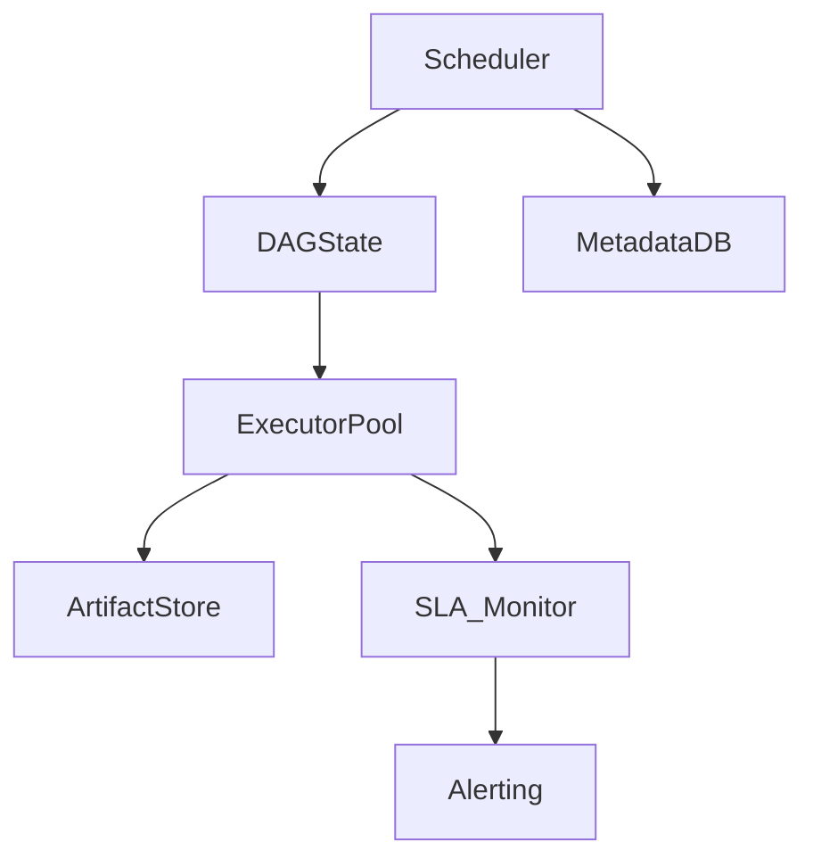

# Job Scheduler (Cron + DAGs) with Retries & SLAs — Deep Dive

## 1. Problem Statement & Scope
Design a scalable, reliable job scheduler supporting cron jobs, dependency DAGs, retries, SLAs, and backfills. The system must orchestrate complex workflows, ensure reliability, and provide observability for operations teams.

## 2. Functional & Non-Functional Requirements

### Functional Requirements
- Schedule jobs via cron or dependency DAGs
- Support retries, backoff, and max attempts
- SLA monitoring and alerting for missed deadlines
- Backfill for missed or failed jobs
- Job artifact and log storage
- Manual and API-triggered runs

### Non-Functional Requirements
- **Scalability:** 100k+ jobs/day, 10k+ concurrent
- **Reliability:** No job loss, at-least-once execution
- **Observability:** Real-time status, logs, and metrics
- **Extensibility:** Pluggable executors, custom hooks

## 3. Core Architecture & Data Model

- **Scheduler Service:** Central brain, plans DAGs, enqueues jobs
- **DAG State Store:** Tracks job dependencies, state, and progress
- **Executor Pool:** Workers that run jobs, report status
- **Artifact Store:** Stores logs, outputs, and artifacts (S3, GCS)
- **SLA Monitor:** Tracks deadlines, triggers alerts
- **Metadata DB:** Stores job definitions, runs, and history

## 4. High-Level Architecture Diagram

## 5. Detailed Workflows

### a) Job Scheduling & Execution
1. User defines job (cron or DAG) via API/UI
2. Scheduler plans DAG, resolves dependencies
3. Runnable jobs enqueued to Executor Pool
4. Executors pick up jobs, run, and report status
5. On failure, retry/backoff logic applied
6. Artifacts/logs uploaded to store
7. SLA Monitor checks deadlines, triggers alerts if missed

### b) Backfill & Manual Runs
1. User triggers backfill for missed/failed jobs
2. Scheduler re-plans DAG, enqueues jobs as needed

### c) SLA Monitoring & Alerting
1. SLA Monitor tracks job deadlines
2. If job exceeds SLA, alert sent to ops/on-call

## 6. Scaling, Fault Tolerance, and Trade-offs

- **Scaling:**
    - Shard executor pool for scale
    - Use distributed queue for job dispatch
- **Fault Tolerance:**
    - Persist all job state to DB
    - Executors heartbeat to detect failures
    - At-least-once execution with idempotent jobs
- **Trade-offs:**
    - Central queue is simple but can bottleneck; per-executor queues scale better
    - Fairness vs throughput: prioritize critical jobs or maximize throughput

## 7. API & Interface Design

### User/Admin APIs
- `POST /jobs`: Create job
- `POST /runs`: Trigger run/backfill
- `GET /jobs/{id}`: Get job status
- `GET /runs/{id}`: Get run status/logs
- `GET /sla`: Get SLA status

## 8. Security & Operational Considerations

- **Security:**
    - Role-based access for job creation and management
    - All actions logged for audit
- **Monitoring:**
    - Real-time dashboards for job status, failures, and SLAs
- **Disaster Recovery:**
    - Regular DB and artifact backups

## 9. Best Practices & Industry Insights

- Use DAGs for complex dependencies, cron for simple schedules
- Persist all state for reliability
- Use idempotent jobs to handle retries safely
- Integrate with alerting/on-call for SLA misses
- Design for manual override and backfill

---

This design is inspired by Airflow, Argo, and other industry schedulers, and can be extended for event-driven triggers, dynamic scaling, and multi-tenant support.
