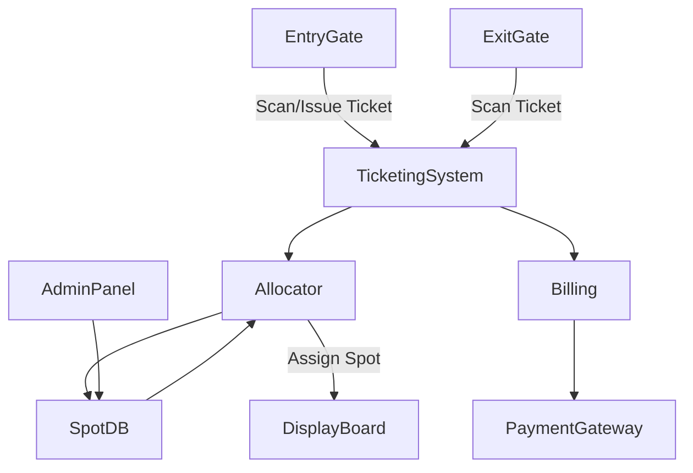

# Parking Lot System Design (Deep Dive)

## 1. Problem Statement & Scope
Design a scalable, multi-floor parking lot system supporting various spot types (regular, compact, handicapped, EV, etc.), dynamic pricing, and real-time spot allocation. The system must handle park/unpark, nearest spot allocation, billing, reservations, and operational edge cases.

## 2. Functional & Non-Functional Requirements

### Functional Requirements
- Park/unpark vehicle (with ticket issuance and validation)
- Find and allocate nearest suitable spot by vehicle type
- Track tickets, entry/exit times, and calculate fees
- Support reservations and dynamic pricing
- Admin APIs for lot status, spot management, and reporting

### Non-Functional Requirements
- **Scalability:** Support 10,000+ spots, 100+ floors, and high QPS at entry/exit
- **Reliability:** No ticket/spot loss, robust against hardware failures
- **Low Latency:** <100ms for park/unpark operations
- **Auditability:** All transactions and events logged

## 3. Core Concepts & Data Model

- **Entities:**
    - `ParkingLot`: Top-level container for all floors
    - `Floor`: Contains multiple `Spot` objects
    - `Spot`: {id, type, isFree, floorId, reservedFor}
    - `Vehicle`: {id, type, licensePlate, owner}
    - `Ticket`: {ticketId, vehicleId, spotId, entryTime, exitTime, status, fee}
    - `Reservation`: {reservationId, spotId, vehicleId, reservedFrom, reservedTo}
- **Allocator:** Pluggable strategy (nearest, cheapest, reserved, etc.)
- **Billing:** Dynamic pricing, discounts, lost ticket handling

## 4. High-Level Architecture

**Components:**
- **Entry/Exit Gates:** Hardware with QR/barcode scanners
- **Ticketing System:** Issues, validates, and tracks tickets
- **Allocator:** Finds optimal spot (nearest, reserved, etc.)
- **SpotDB:** Stores real-time spot status (in-memory + persistent DB)
- **Billing:** Calculates fees, applies discounts, handles lost tickets
- **Admin Panel:** For monitoring, reporting, and manual overrides

## 5. Detailed Workflows

### a) Parking a Vehicle
1. Vehicle arrives at entry gate
2. System scans license plate or issues new ticket
3. Allocator finds nearest available spot of required type
4. Spot is reserved and displayed to driver
5. Ticket is updated with spotId, entryTime
6. Spot status updated in SpotDB (atomic operation)

### b) Unparking a Vehicle
1. Vehicle arrives at exit gate, presents ticket
2. System fetches ticket, calculates duration and fee
3. Payment processed (cash/card/app)
4. Spot marked as free, ticket closed
5. All events logged for audit

### c) Reservation Flow
1. User reserves spot via app/website
2. System blocks spot for reservation window
3. On arrival, reservation is validated and spot is assigned

### d) Lost Ticket Handling
1. User reports lost ticket at exit
2. System verifies vehicle via license plate/camera
3. Admin override or maximum fee applied

## 6. Scaling, Fault Tolerance, and Trade-offs

- **Scaling:**
    - Use sharded SpotDB for large lots
    - In-memory cache for real-time spot status, with periodic DB sync
    - Async event processing for ticketing and billing
- **Fault Tolerance:**
    - Redundant entry/exit hardware
    - Persistent logs for all transactions
    - Graceful fallback to manual mode on system failure
- **Trade-offs:**
    - Nearest-spot allocation is fast but may not optimize for exit speed
    - Dynamic pricing increases complexity but maximizes revenue

## 7. API & Interface Design

### User APIs
- `POST /park`: Park vehicle, returns ticket and spot info
- `POST /unpark`: Unpark vehicle, returns fee
- `GET /status`: Get lot/floor/spot status
- `POST /reserve`: Reserve spot

### Admin APIs
- `GET /report`: Usage, revenue, occupancy
- `POST /override`: Manual spot/ticket override

## 8. Security & Operational Considerations

- **Security:**
    - Secure entry/exit with cameras and ticket validation
    - Prevent ticket reuse and fraud
- **Monitoring:**
    - Real-time dashboards for occupancy, revenue, and incidents
- **Disaster Recovery:**
    - Regular DB backups, failover hardware

## 9. Best Practices & Industry Insights

- Use atomic operations for spot allocation to avoid double-booking
- Prefer in-memory cache for real-time status, but always persist to DB
- Integrate with payment gateways for seamless billing
- Use event sourcing for auditability and replay
- Design for manual override in all critical paths

---

This design is inspired by real-world systems like Park+ and NEXPA, and can be extended for EV charging, valet, and smart parking integrations.
