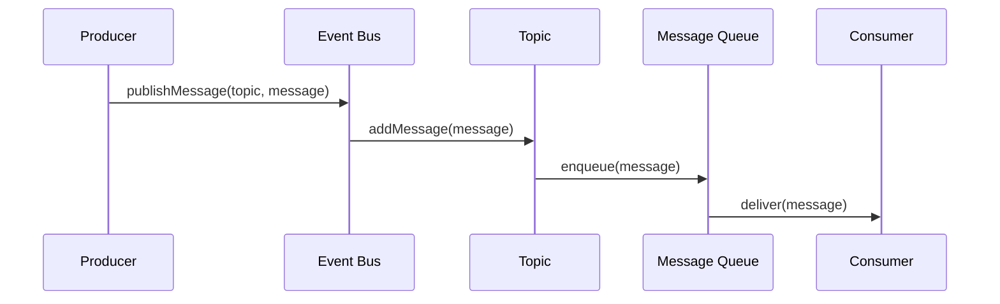
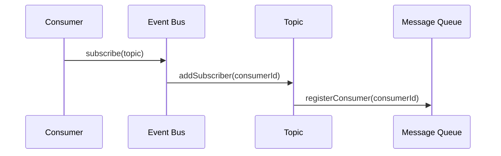
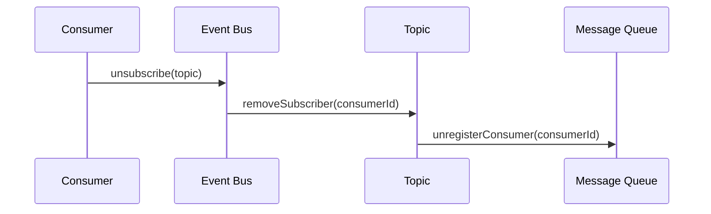
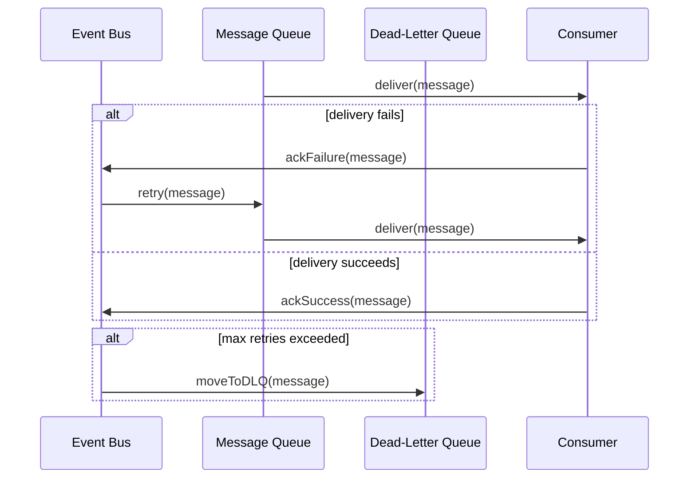

# Publisher–Subscriber Notification Service

This problem involves designing an in-process publisher-subscriber (pub-sub) system to decouple components within an application. This pattern is fundamental for building modular, event-driven architectures, allowing different parts of a system to react to events without being tightly coupled.

### **1. System Overview & Scope Clarification**

We are building an event bus that operates within a single application instance. Producers publish events to named "topics," and consumers subscribe to these topics to receive the events. The core goal is to make this communication asynchronous and resilient.

**Functional Requirements (FR):**

- **Topic-based Messaging:** Producers send messages (events) to topics. Consumers subscribe to topics to receive messages.
- **Decoupled Communication:** A single event can be received by multiple, independent subscribers.
- **Durable Queues:** Each subscription will have its own queue to buffer messages. This ensures that a slow consumer doesn't block the producer or other consumers.
- **At-Least-Once Delivery:** The system must guarantee that a published message is delivered to a subscriber at least once. This implies a retry mechanism for failed deliveries.
- **Dead-Letter Queue (DLQ):** Messages that consistently fail delivery after several retries should be moved to a DLQ for later inspection.

**Non-Functional Requirements (NFR):**

- **Performance:** The system should handle a high throughput of messages and support a large number of topics and subscribers.
- **Scalability:** It should be easy to add more topics, producers, or consumers without significant changes to the system.
- **Reliability:** The system should be resilient to individual component failures. If a consumer fails, the messages should remain in the queue for that consumer until they are successfully processed or moved to the DLQ.
- **Maintainability:** The system should be easy to maintain and extend. New features or changes in the business logic should require minimal changes to the existing code.

**Out of Scope:**

- **Inter-Process Communication:** The event bus is designed for communication within a single application instance. Cross-application or cross-network communication is out of scope.
- **Message Content:** The format and structure of the messages are not defined by the event bus. It is assumed that the producers and consumers will agree on the message format.
- **Security:** There is no mention of security requirements like authentication, authorization, or encryption. It is assumed that the event bus will be used within a trusted environment.

### **2. High-Level Architecture**

The system consists of the following components:

- **Event Bus:** The core component that manages topics, subscriptions, and message delivery.
- **Producers:** Components that publish messages to topics on the event bus.
- **Consumers:** Components that subscribe to topics and process the received messages.
- **Message Queues:** Each subscription has a dedicated queue to store the messages until they are processed by the consumer.
- **Dead-Letter Queue (DLQ):** A special queue for messages that could not be delivered after several retries.

### **3. Component Design**

#### **3.1 Event Bus**

The event bus is the central component that manages the communication between producers and consumers. It maintains a registry of topics and their associated subscriptions. It is responsible for:

- Accepting new topic creation requests.
- Managing subscriptions to topics.
- Publishing messages to the appropriate topics.
- Delivering messages to subscribers.
- Retrying failed deliveries.
- Moving undeliverable messages to the DLQ.

#### **3.2 Producers**

Producers are components that create and send messages to topics on the event bus. They are responsible for:

- Creating messages with the necessary data.
- Sending messages to the appropriate topic on the event bus.
- Handling any errors or retries if the message delivery fails.

#### **3.3 Consumers**

Consumers are components that receive and process messages from the event bus. They are responsible for:

- Subscribing to the relevant topics on the event bus.
- Receiving messages from the event bus.
- Processing the received messages.
- Acknowledging the successful processing of messages.
- Handling any errors or retries if the message processing fails.

#### **3.4 Message Queues**

Message queues are used to store the messages for each subscription. They provide a buffer between the event bus and the consumers, allowing for asynchronous communication. They are responsible for:

- Storing the messages until they are processed by the consumer.
- Supporting concurrent access by the event bus and the consumer.
- Providing mechanisms for message acknowledgment and retries.

#### **3.5 Dead-Letter Queue (DLQ)**

The DLQ is a special queue for messages that could not be delivered to the consumer after several retries. It allows for the inspection and reprocessing of undeliverable messages. It is responsible for:

- Storing the undeliverable messages.
- Providing mechanisms for inspecting and reprocessing the messages.
- Supporting alerting or notification mechanisms for manual intervention.

### **4. Sequence Diagrams**

#### **4.1 Publish Message**



#### **4.2 Subscribe to Topic**



#### **4.3 Unsubscribe from Topic**



#### **4.4 Retry Mechanism**



### **5. Code Examples**

#### **5.1 Event Bus**

```python
class EventBus:
    def __init__(self):
        self.topics = {}
        self.dlq = DeadLetterQueue()

    def publish(self, topic_name, message):
        topic = self.topics.get(topic_name)
        if topic:
            topic.publish(message)
        else:
            print(f"Topic {topic_name} does not exist.")

    def subscribe(self, topic_name, subscriber):
        topic = self.topics.get(topic_name)
        if topic:
            topic.add_subscriber(subscriber)
        else:
            print(f"Topic {topic_name} does not exist.")

    def unsubscribe(self, topic_name, subscriber):
        topic = self.topics.get(topic_name)
        if topic:
            topic.remove_subscriber(subscriber)
        else:
            print(f"Topic {topic_name} does not exist.")

    def create_topic(self, topic_name):
        if topic_name not in self.topics:
            self.topics[topic_name] = Topic(topic_name)
        else:
            print(f"Topic {topic_name} already exists.")

    def delete_topic(self, topic_name):
        if topic_name in self.topics:
            del self.topics[topic_name]
        else:
            print(f"Topic {topic_name} does not exist.")

class Topic:
    def __init__(self, name):
        self.name = name
        self.subscribers = []
        self.queue = MessageQueue()

    def publish(self, message):
        self.queue.enqueue(message)
        for subscriber in self.subscribers:
            subscriber.notify(message)

    def add_subscriber(self, subscriber):
        self.subscribers.append(subscriber)

    def remove_subscriber(self, subscriber):
        self.subscribers.remove(subscriber)
```

#### **5.2 Producers and Consumers**

```python
class Producer:
    def __init__(self, event_bus):
        self.event_bus = event_bus

    def publish(self, topic_name, message):
        self.event_bus.publish(topic_name, message)

class Consumer:
    def __init__(self, event_bus):
        self.event_bus = event_bus

    def subscribe(self, topic_name):
        self.event_bus.subscribe(topic_name, self)

    def unsubscribe(self, topic_name):
        self.event_bus.unsubscribe(topic_name, self)

    def notify(self, message):
        print(f"Received message: {message}")
```

#### **5.3 Message Queue and Dead-Letter Queue**

```python
class MessageQueue:
    def __init__(self):
        self.messages = []
        self.consumers = []

    def enqueue(self, message):
        self.messages.append(message)

    def deliver(self, consumer):
        if self.messages:
            message = self.messages.pop(0)
            consumer.notify(message)

class DeadLetterQueue:
    def __init__(self):
        self.messages = []

    def move_to_dlq(self, message):
        self.messages.append(message)

    def reprocess(self, message):
        # Logic to reprocess the message
        pass
```

### **6. Error Handling & Reliability**

- Implement a retry mechanism with exponential backoff for failed message deliveries.
- Move undeliverable messages to the DLQ after a certain number of retries.
- Provide mechanisms for monitoring and alerting on DLQ messages.

### **7. Performance Considerations**

- Optimize the message queue implementation for high throughput and low latency.
- Consider using a more efficient data structure for the message queue, like a ring buffer.
- Implement batch processing of messages for consumers to reduce the overhead of individual message processing.

### **8. Security Considerations**

- Implement authentication and authorization mechanisms for producers and consumers.
- Consider encrypting the messages for confidentiality.
- Implement auditing and logging of message deliveries and errors.

### **9. Future Enhancements**

- Support for message filtering based on content or attributes.
- Support for message prioritization.
- Support for transactions or message grouping.
- Support for distributed or clustered event bus for scalability.

### **10. Conclusion**

The Publisher–Subscriber Notification Service provides a flexible and decoupled communication mechanism for building event-driven architectures. By implementing the pub-sub pattern, systems can achieve better modularity, scalability, and resilience. The proposed design and implementation provide a solid foundation for building such a system, with considerations for reliability, performance, and security.
